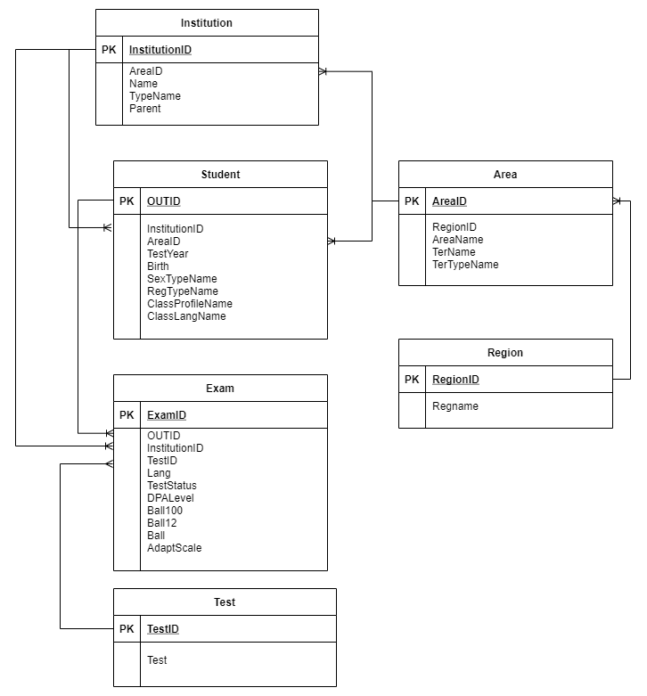
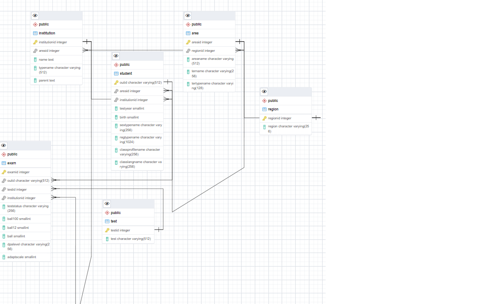

# Лабораторна робота №2 студентки групи КМ-81 Юр'єваї Ксенії

Перед запуском програми додайте в папку проекту файли *Odata2019File.csv*, *Odata2020File.csv*

## Інструкція по запуску

В окремому терміналі/консолі запустити

- `docker-compose up`

В браузері відкрити PGAdmin: http://localhost:8081

- Логін та пароль до PGAdmin: `admin@kpi.ua`, `admin`

В лівому вікні натиснути правою кнопкою миші на _Servers_ і обрати _Create -> Server_

- Логін та пароль до сервера: `postgres`
- Host name: `db`

Послідовно виконати наступні команди:

- Linux/MacOS

```bash
python3 -m pip install virtualenv
python3 -m venv env
source env/bin/activate
source .env
python3 -m pip install -r requirements.txt
python3 main.py
```

- Windows

```
py -m pip install --user virtualenv
py -m venv env
.\env\Scripts\activate
env.bat
py -m pip install -r requirements.txt
py main.py
```

Після виконання програми в іншому терміналі запустити `docker-compose -f docker-compose-flyway.yml up`.
В результаті створиться основна таблиця "Student" та 5 пов'язаних з нею таблиць. Відбудеться міграція даних, після завершення якої таблиця GeneralTable видалиться.


 
 